<sup>📒 Readme ver 1.0 23.11.2025 14:15<sup/>


# `Лабораторна робота` `№7` `Знайомство з Maven`

[](https://docs.google.com/document/d/1ZyX1IAYlUHXQJubkIOdQCXgsGvJE3Yt3/edit)
[](https://github.com/Soluvent)


[](https://github.com/Soluvent/MavenExample-Seventh)

## `📝 Завдання `
### Система автоматичної збірки проектів Maven
  - [x] Розглянути приклад практичної частини та створити простий Maven-проєкт
  - [x] Клонувати та запустити проєкт Investment Calculator з GitHub
  - [x] Додати функцію збереження результатів до текстового файлу
  - [x] Написати 3+ модульних тестів на базі JUnit 5
  - [x] Налаштувати pom.xml з усіма необхідними залежностями та плагінами

## `🧠 Mindmap `

```mermaid
graph LR;
    A[Завдання 1: Базовий Maven]:::task1 --> B[Створення структури проєкту]:::step1
    B --> C[Налаштування pom.xml]:::step1
    C --> D[Простий Swing застосунок]:::step1
    D --> E[Компіляція та запуск]:::step1
    
    classDef task1 fill:#C8E6C9,stroke:#66BB6A,stroke-width:3px,rx:20,ry:20,color:#1B5E20
    classDef step1 fill:#F1F8F4,stroke:#81C784,stroke-width:2px,rx:16,ry:16,color:#2E7D32
```

```mermaid
graph LR;
    A[Завдання 3: Збереження у файл]:::task3 --> B[Додати Apache Commons IO]:::step3
    B --> C[Створити TextFileSaver]:::step3
    C --> D[Форматування звіту]:::step3
    D --> E[Інтеграція в GUI]:::step3
    E --> F[Тестування функції]:::step3
    
    classDef task3 fill:#A5D6A7,stroke:#4CAF50,stroke-width:3px,rx:20,ry:20,color:#1B5E20
    classDef step3 fill:#F1F8F4,stroke:#66BB6A,stroke-width:2px,rx:16,ry:16,color:#2E7D32
```





## `🛠️ Реалізація коду `

## Завдання 1: Простий Maven-проєкт (Lab7_1)

### **Структура проєкту**
> [!NOTE]
> Стандартна структура Maven-проєкту включає директорії для вихідного коду (`src/main/java`), ресурсів (`src/main/resources`) та тестів (`src/test/java`). Файл `pom.xml` в кореневій директорії описує всю конфігурацію проєкту.

```
desktop-demo/
├── pom.xml
└── src/
    ├── main/
    │   └── java/
    │       └── ua/edu/app/
    │           └── MainApp.java
    └── test/
        └── java/
```

### **Файл pom.xml**
> [!NOTE]
> Project Object Model (POM) - це серце Maven-проєкту. Він містить координати проєкту (groupId, artifactId, version), налаштування компілятора, залежності та плагіни для збірки.

<h4 align="wide">

```xml
<?xml version="1.0" encoding="UTF-8"?>
<project xmlns="http://maven.apache.org/POM/4.0.0"
         xmlns:xsi="http://www.w3.org/2001/XMLSchema-instance"
         xsi:schemaLocation="http://maven.apache.org/POM/4.0.0 
         http://maven.apache.org/xsd/maven-4.0.0.xsd">
    <modelVersion>4.0.0</modelVersion>
    
    <!-- Координати проєкту (GAV) -->
    <groupId>ua.edu.app</groupId>
    <artifactId>desktop-demo</artifactId>
    <version>1.0-SNAPSHOT</version>
    <packaging>jar</packaging>
    
    <n>Desktop Demo</n>
    
    <!-- Властивості проєкту -->
    <properties>
        <maven.compiler.source>17</maven.compiler.source>
        <maven.compiler.target>17</maven.compiler.target>
        <project.build.sourceEncoding>UTF-8</project.build.sourceEncoding>
    </properties>
    
    <!-- Залежності -->
    <dependencies>
        <dependency>
            <groupId>junit</groupId>
            <artifactId>junit</artifactId>
            <version>4.13.2</version>
            <scope>test</scope>
        </dependency>
    </dependencies>
    
    <!-- Плагіни для збірки -->
    <build>
        <plugins>
            <!-- Плагін для компіляції -->
            <plugin>
                <groupId>org.apache.maven.plugins</groupId>
                <artifactId>maven-compiler-plugin</artifactId>
                <version>3.11.0</version>
                <configuration>
                    <source>17</source>
                    <target>17</target>
                </configuration>
            </plugin>
            
            <!-- Плагін для запуску застосунку -->
            <plugin>
                <groupId>org.codehaus.mojo</groupId>
                <artifactId>exec-maven-plugin</artifactId>
                <version>3.1.0</version>
                <configuration>
                    <mainClass>ua.edu.app.MainApp</mainClass>
                </configuration>
            </plugin>
            
            <!-- Плагін для створення виконуваного JAR -->
            <plugin>
                <groupId>org.apache.maven.plugins</groupId>
                <artifactId>maven-jar-plugin</artifactId>
                <version>3.3.0</version>
                <configuration>
                    <archive>
                        <manifest>
                            <addClasspath>true</addClasspath>
                            <mainClass>ua.edu.app.MainApp</mainClass>
                        </manifest>
                    </archive>
                </configuration>
            </plugin>
        </plugins>
    </build>
</project>
```

### **MainApp.java - Простий Swing застосунок**
> [!NOTE]
> Простий десктоп-застосунок з графічним інтерфейсом на базі Swing. Використовує `SwingUtilities.invokeLater()` для коректної роботи в Event Dispatch Thread. Демонструє створення вікна, мітки та кнопки з обробником події.

<h4 align="wide">

```java
package ua.edu.app;

import javax.swing.*;
import java.awt.*;

public class MainApp {
    public static void main(String[] args) {
        // Запуск GUI в Event Dispatch Thread
        SwingUtilities.invokeLater(() -> {
            // Створення головного вікна
            JFrame frame = new JFrame("Демонстраційний застосунок");
            frame.setDefaultCloseOperation(JFrame.EXIT_ON_CLOSE);
            frame.setSize(400, 200);
            
            // Створення панелі з BorderLayout
            JPanel panel = new JPanel(new BorderLayout());
            
            // Мітка з вітальним текстом
            JLabel label = new JLabel("Вітаємо у світі Maven та Swing!", 
                                     SwingConstants.CENTER);
            
            // Кнопка закриття
            JButton button = new JButton("Закрити");
            button.addActionListener(e -> System.exit(0));
            
            // Додавання компонентів на панель
            panel.add(label, BorderLayout.CENTER);
            panel.add(button, BorderLayout.SOUTH);
            
            // Додавання панелі до вікна
            frame.add(panel);
            frame.setVisible(true);
        });
    }
}
```

### **Maven команди для роботи з проєктом**
> [!NOTE]
> Maven має чіткий життєвий цикл збірки з фазами: validate, compile, test, package, install, deploy. Кожна команда автоматично виконує всі попередні фази.

```bash
# Очистити попередні результати збірки
mvn clean

# Скомпілювати вихідний код
mvn compile

# Запустити тести
mvn test

# Створити JAR-архів
mvn package

# Запустити застосунок через Maven
mvn exec:java

# Запустити створений JAR
java -jar target/desktop-demo-1.0-SNAPSHOT.jar

# Встановити артефакт у локальний репозиторій
mvn install
```

## Завдання 2-4: Investment Calculator з розширеною функціональністю (Lab7)

### **Структура проєкту Investment Calculator**
> [!NOTE]
> Реальний Maven-проєкт з модульною архітектурою. Включає моделі даних (InvestmentResult, YearlyData, MonthlyData), обчислювальний движок (FinalInvestmentEngine), компоненти візуалізації (панелі графіків) та утиліти експорту (CsvExporter, TextFileSaver).

```
investment-calculator/
├── pom.xml
├── src/
│   ├── main/
│   │   └── java/
│   │       └── com/investmentcalc/
│   │           ├── InvestmentCalculator.java    # Головний клас з GUI
│   │           ├── FinalInvestmentEngine.java   # Обчислювальний движок
│   │           ├── InvestmentResult.java        # Модель результатів
│   │           ├── YearlyData.java              # Річні дані
│   │           ├── MonthlyData.java             # Місячні дані
│   │           ├── InvestmentChartPanel.java    # Лінійний графік
│   │           ├── InvestmentPieChartPanel.java # Кругова діаграма
│   │           ├── CsvExporter.java             # Експорт в CSV
│   │           └── TextFileSaver.java           # Збереження у текст (NEW)
│   └── test/
│       └── java/
│           └── com/investmentcalc/
│               ├── FinalInvestmentEngineTest.java
│               ├── ScheduleTest.java
│               ├── CsvExporterTest.java
│               └── AdditionalInvestmentTests.java # Нові тести (NEW)
└── target/
    └── investment-calculator-1.0.0.jar
```

### **pom.xml з усіма залежностями**
> [!NOTE]
> Розширений POM з залежностями для візуалізації (JFreeChart), сучасного інтерфейсу (FlatLaf), роботи з файлами (Apache Commons IO) та тестування (JUnit 5). Використовується maven-shade-plugin для створення fat-jar з усіма залежностями.

<h4 align="wide">

```xml
<?xml version="1.0" encoding="UTF-8"?>
<project xmlns="http://maven.apache.org/POM/4.0.0"
         xmlns:xsi="http://www.w3.org/2001/XMLSchema-instance"
         xsi:schemaLocation="http://maven.apache.org/POM/4.0.0 
         http://maven.apache.org/xsd/maven-4.0.0.xsd">
    <modelVersion>4.0.0</modelVersion>

    <groupId>com.investmentcalc</groupId>
    <artifactId>investment-calculator</artifactId>
    <version>1.0.0</version>
    <packaging>jar</packaging>

    <n>Investment Calculator</n>
    <description>
        Комплексний калькулятор інвестицій з розрахунком складних відсотків та візуалізацією
    </description>

    <properties>
        <maven.compiler.source>11</maven.compiler.source>
        <maven.compiler.target>11</maven.compiler.target>
        <project.build.sourceEncoding>UTF-8</project.build.sourceEncoding>
    </properties>

    <dependencies>
        <!-- JFreeChart для побудови графіків -->
        <dependency>
            <groupId>org.jfree</groupId>
            <artifactId>jfreechart</artifactId>
            <version>1.5.3</version>
        </dependency>
        
        <!-- JCommon для JFreeChart -->
        <dependency>
            <groupId>org.jfree</groupId>
            <artifactId>jcommon</artifactId>
            <version>1.0.24</version>
        </dependency>

        <!-- FlatLaf для сучасного вигляду інтерфейсу -->
        <dependency>
            <groupId>com.formdev</groupId>
            <artifactId>flatlaf</artifactId>
            <version>3.2.5</version>
        </dependency>

        <!-- Apache Commons IO для роботи з файлами (ДОДАНО У ЗАВДАННІ 3) -->
        <dependency>
            <groupId>commons-io</groupId>
            <artifactId>commons-io</artifactId>
            <version>2.11.0</version>
        </dependency>

        <!-- JUnit 5 для модульного тестування -->
        <dependency>
            <groupId>org.junit.jupiter</groupId>
            <artifactId>junit-jupiter</artifactId>
            <version>5.9.2</version>
            <scope>test</scope>
        </dependency>
    </dependencies>

    <build>
        <plugins>
            <!-- Плагін компіляції -->
            <plugin>
                <groupId>org.apache.maven.plugins</groupId>
                <artifactId>maven-compiler-plugin</artifactId>
                <version>3.11.0</version>
                <configuration>
                    <source>11</source>
                    <target>11</target>
                </configuration>
            </plugin>
            
            <!-- Maven Shade Plugin для створення fat-jar -->
            <plugin>
                <groupId>org.apache.maven.plugins</groupId>
                <artifactId>maven-shade-plugin</artifactId>
                <version>3.4.1</version>
                <executions>
                    <execution>
                        <phase>package</phase>
                        <goals>
                            <goal>shade</goal>
                        </goals>
                        <configuration>
                            <transformers>
                                <transformer 
                                    implementation="org.apache.maven.plugins.shade.resource.ManifestResourceTransformer">
                                    <mainClass>com.investmentcalc.InvestmentCalculator</mainClass>
                                </transformer>
                            </transformers>
                        </configuration>
                    </execution>
                </executions>
            </plugin>

            <!-- Surefire Plugin для запуску тестів -->
            <plugin>
                <groupId>org.apache.maven.plugins</groupId>
                <artifactId>maven-surefire-plugin</artifactId>
                <version>3.0.0-M9</version>
            </plugin>
        </plugins>
    </build>
</project>
```

## Завдання 3: TextFileSaver - Збереження результатів у файл

### **Клас TextFileSaver**
> [!NOTE]
> Утилітний клас для збереження результатів обчислень у текстовий файл. Використовує Apache Commons IO для надійної роботи з файлами. Форматує дані у структурований звіт з секціями: заголовок, вхідні параметри, фінальні результати та річна таблиця.

<h4 align="wide">

```java
package com.investmentcalc;

import org.apache.commons.io.FileUtils;
import java.io.File;
import java.io.IOException;
import java.math.BigDecimal;
import java.text.SimpleDateFormat;
import java.util.Date;
import java.nio.charset.StandardCharsets;

/**
 * Утилітний клас для збереження результатів інвестиційних розрахунків у текстовий файл
 * Використовує бібліотеку Apache Commons IO для операцій з файлами
 */
public class TextFileSaver {
    
    private static final String DEFAULT_FILENAME = "investment_results.txt";
    private static final String DATE_FORMAT = "yyyy-MM-dd HH:mm:ss";
    
    /**
     * Зберігає результати розрахунків у текстовий файл
     * @param result Об'єкт InvestmentResult з даними розрахунків
     * @param filename Ім'я файлу для збереження
     * @return true якщо збереження успішне, false у іншому випадку
     */
    public static boolean saveResultsToFile(InvestmentResult result, String filename) {
        if (result == null) {
            return false;
        }
        
        String targetFilename = (filename != null && !filename.isEmpty()) 
            ? filename : DEFAULT_FILENAME;
        File file = new File(targetFilename);
        
        try {
            String content = formatResultsForFile(result);
            // Використання Apache Commons IO для запису файлу
            FileUtils.writeStringToFile(file, content, StandardCharsets.UTF_8);
            return true;
        } catch (IOException e) {
            System.err.println("Помилка збереження файлу: " + e.getMessage());
            return false;
        }
    }
    
    /**
     * Форматує результати інвестицій у читабельний текстовий формат
     */
    private static String formatResultsForFile(InvestmentResult result) {
        StringBuilder sb = new StringBuilder();
        SimpleDateFormat sdf = new SimpleDateFormat(DATE_FORMAT);
        
        // Заголовок звіту
        sb.append("=".repeat(60)).append("\n");
        sb.append("INVESTMENT CALCULATION RESULTS\n");
        sb.append("=".repeat(60)).append("\n\n");
        
        // Часова мітка генерації
        sb.append("Generated on: ").append(sdf.format(new Date())).append("\n\n");
        
        // Секція вхідних параметрів
        sb.append("INPUT PARAMETERS:\n");
        sb.append("-".repeat(40)).append("\n");
        sb.append(String.format("Starting Amount:        $%,.2f\n", 
            result.getStartingAmount()));
        sb.append(String.format("Investment Period:      %d years\n", 
            result.getYears()));
        sb.append(String.format("Annual Return Rate:     %.2f%%\n", 
            result.getAnnualReturnRate()));
        sb.append(String.format("Compounding Frequency:  %s\n", 
            result.getCompoundingFrequency()));
        sb.append("\n");
        
        // Секція фінальних результатів
        sb.append("FINAL RESULTS:\n");
        sb.append("-".repeat(40)).append("\n");
        sb.append(String.format("End Balance:           $%,.2f\n", 
            result.getEndBalance()));
        sb.append(String.format("Total Contributions:   $%,.2f\n", 
            result.getTotalContributions()));
        sb.append(String.format("Total Interest Earned: $%,.2f\n", 
            result.getTotalInterest()));
        
        // Розрахунок загальної доходності
        BigDecimal totalReturn = result.getTotalInterest()
            .divide(result.getTotalContributions(), 4, BigDecimal.ROUND_HALF_UP)
            .multiply(new BigDecimal("100"));
        sb.append(String.format("Total Return:          %.2f%%\n", totalReturn));
        sb.append("\n");
        
        // Річна таблиця (якщо доступна)
        if (result.getYearlyData() != null && !result.getYearlyData().isEmpty()) {
            sb.append("YEARLY SUMMARY:\n");
            sb.append("-".repeat(40)).append("\n");
            sb.append(String.format("%-6s | %-15s | %-15s\n", 
                "Year", "Balance", "Interest"));
            sb.append("-".repeat(40)).append("\n");
            
            for (YearlyData yearly : result.getYearlyData()) {
                sb.append(String.format("%-6d | $%,-14.2f | $%,-14.2f\n",
                    yearly.getYear(),
                    yearly.getEndBalance(),
                    yearly.getInterestEarned()));
            }
        }
        
        sb.append("\n");
        sb.append("=".repeat(60)).append("\n");
        sb.append("End of Report\n");
        sb.append("=".repeat(60)).append("\n");
        
        return sb.toString();
    }
}
```

### **Інтеграція в GUI**
> [!NOTE]
> Додавання нової кнопки "Save to Text File" до інтерфейсу калькулятора. При натисканні відкривається діалог вибору файлу (JFileChooser), після чого викликається метод TextFileSaver для збереження результатів. Відображаються повідомлення про успіх або помилку.

<h4 align="wide">

```java
// У класі InvestmentCalculator додано:

private void addSaveToTextButton(JPanel panel, GridBagConstraints gbc) {
    JButton saveTextButton = new JButton("Save to Text File");
    saveTextButton.setBackground(new Color(76, 175, 80)); // Зелений колір
    saveTextButton.setForeground(Color.WHITE);
    
    saveTextButton.addActionListener(e -> saveResultsToTextFile());
    
    gbc.gridx = 1;
    gbc.gridy = 8;
    gbc.gridwidth = 1;
    panel.add(saveTextButton, gbc);
}

private void saveResultsToTextFile() {
    if (lastResult == null) {
        JOptionPane.showMessageDialog(this,
            "Спочатку виконайте розрахунок!",
            "Попередження",
            JOptionPane.WARNING_MESSAGE);
        return;
    }
    
    // Створення діалогу вибору файлу
    JFileChooser fileChooser = new JFileChooser();
    fileChooser.setSelectedFile(new File("investment_results.txt"));
    
    int result = fileChooser.showSaveDialog(this);
    
    if (result == JFileChooser.APPROVE_OPTION) {
        File file = fileChooser.getSelectedFile();
        boolean success = TextFileSaver.saveResultsToFile(lastResult, 
                                                          file.getAbsolutePath());
        
        if (success) {
            JOptionPane.showMessageDialog(this,
                "Результати успішно збережено до:\n" + file.getAbsolutePath(),
                "Успіх",
                JOptionPane.INFORMATION_MESSAGE);
        } else {
            JOptionPane.showMessageDialog(this,
                "Помилка збереження файлу!",
                "Помилка",
                JOptionPane.ERROR_MESSAGE);
        }
    }
}
```

## Завдання 4: Модульні тести з JUnit 5

### **AdditionalInvestmentTests - Клас з новими тестами**
> [!NOTE]
> Комплексний набір модульних тестів для перевірки нової функціональності та існуючої логіки. Використовує JUnit 5 з анотаціями @BeforeEach та @AfterEach для підготовки та очищення тестового середовища. Включає перевірку збереження файлів, математичної коректності обчислень та граничних випадків.

<h4 align="wide">

```java
package com.investmentcalc;

import org.junit.jupiter.api.Test;
import org.junit.jupiter.api.BeforeEach;
import org.junit.jupiter.api.AfterEach;
import static org.junit.jupiter.api.Assertions.*;

import java.math.BigDecimal;
import java.math.RoundingMode;
import java.io.File;
import java.io.IOException;
import java.nio.file.Files;
import java.nio.file.Paths;

/**
 * Додаткові модульні тести для Investment Calculator
 * Тестують нову функціональність збереження у файл та граничні випадки
 */
public class AdditionalInvestmentTests {
    
    private FinalInvestmentEngine engine;
    private static final String TEST_FILE = "test_investment_results.txt";
    
    @BeforeEach
    void setUp() {
        engine = new FinalInvestmentEngine();
        // Очищення тестового файлу перед кожним тестом
        File testFile = new File(TEST_FILE);
        if (testFile.exists()) {
            testFile.delete();
        }
    }
    
    @AfterEach
    void tearDown() {
        // Очищення після кожного тесту
        File testFile = new File(TEST_FILE);
        if (testFile.exists()) {
            testFile.delete();
        }
    }
    
    /**
     * Тест 1: Перевірка коректності збереження результатів у файл
     */
    @Test
    void testTextFileSaverSavesResults() {
        System.out.println("\n=== Тест 1: Функціональність TextFileSaver ===");
        
        // Створення тестових даних
        BigDecimal startingAmount = new BigDecimal("5000");
        int years = 3;
        BigDecimal returnRate = new BigDecimal("8");
        String frequency = "Monthly";
        
        // Виконання розрахунку
        InvestmentResult result = engine.calculateInvestment(
            startingAmount, years, returnRate, frequency,
            new BigDecimal("100"), 12, true);
        
        // Збереження у файл
        boolean saveSuccess = TextFileSaver.saveResultsToFile(result, TEST_FILE);
        
        // Перевірки
        File file = new File(TEST_FILE);
        
        assertTrue(saveSuccess, "Збереження файлу має повернути true");
        assertTrue(file.exists(), "Файл має бути створений");
        assertTrue(file.length() > 0, "Файл не має бути порожнім");
        
        // Перевірка вмісту файлу
        try {
            String content = new String(Files.readAllBytes(Paths.get(TEST_FILE)));
            assertTrue(content.contains("INVESTMENT CALCULATION RESULTS"), 
                "Файл має містити заголовок");
            assertTrue(content.contains("Starting Amount"), 
                "Файл має містити мітку початкової суми");
            assertTrue(content.contains("5,000"), 
                "Файл має містити відформатовану початкову суму");
            assertTrue(content.contains("YEARLY SUMMARY"), 
                "Файл має містити річну таблицю");
            
            System.out.println("Перевірка вмісту файлу: ✅ ПРОЙДЕНО");
        } catch (IOException e) {
            fail("Помилка читання тестового файлу: " + e.getMessage());
        }
        
        System.out.println("Результат: ✅ ПРОЙДЕНО");
    }
    
    /**
     * Тест 2: Перевірка розрахунків з квартальною капіталізацією
     */
    @Test
    void testQuarterlyCompounding() {
        System.out.println("\n=== Тест 2: Квартальна капіталізація ===");
        
        BigDecimal startingAmount = new BigDecimal("10000");
        int years = 2;
        BigDecimal returnRate = new BigDecimal("6");
        String frequency = "Quarterly";
        
        // Розрахунок з квартальною капіталізацією
        InvestmentResult result = engine.calculateInvestment(
            startingAmount, years, returnRate, frequency,
            new BigDecimal("0"), 0, false);
        
        // Очікуване значення: 10000 * (1 + 0.06/4)^(4*2) ≈ 11264.93
        BigDecimal expected = new BigDecimal("11264.93");
        BigDecimal actual = result.getEndBalance().setScale(2, RoundingMode.HALF_UP);
        
        System.out.printf("Очікувано: $%s\n", expected);
        System.out.printf("Отримано:  $%s\n", actual);
        
        // Допускаємо похибку округлення до $1
        BigDecimal difference = actual.subtract(expected).abs();
        boolean withinTolerance = difference.compareTo(new BigDecimal("1.00")) <= 0;
        
        assertTrue(withinTolerance, 
            "Квартальна капіталізація має давати ≈$11,264.93");
        
        System.out.println("Результат: ✅ ПРОЙДЕНО");
    }
    
    /**
     * Тест 3: Перевірка щотижневої капіталізації з регулярними внесками
     */
    @Test
    void testWeeklyCompoundingWithContributions() {
        System.out.println("\n=== Тест 3: Щотижнева капіталізація з внесками ===");
        
        BigDecimal startingAmount = new BigDecimal("1000");
        int years = 1;
        BigDecimal returnRate = new BigDecimal("10");
        String frequency = "Weekly";
        BigDecimal weeklyContribution = new BigDecimal("50");
        int contributionFrequency = 52;
        
        // Розрахунок
        InvestmentResult result = engine.calculateInvestment(
            startingAmount, years, returnRate, frequency,
            weeklyContribution, contributionFrequency, true);
        
        BigDecimal endBalance = result.getEndBalance();
        BigDecimal totalContributions = result.getTotalContributions();
        BigDecimal totalInterest = result.getTotalInterest();
        
        System.out.printf("Кінцевий баланс: $%,.2f\n", endBalance);
        System.out.printf("Всього внесків: $%,.2f\n", totalContributions);
        System.out.printf("Зароблений дохід: $%,.2f\n", totalInterest);
        
        // Перевірки
        assertTrue(endBalance.compareTo(startingAmount) > 0, 
            "Кінцевий баланс має бути більшим за початковий");
        
        // Перевірка загальної суми внесків
        BigDecimal expectedContributions = startingAmount.add(
            weeklyContribution.multiply(new BigDecimal(contributionFrequency)));
        assertEquals(expectedContributions, totalContributions,
            "Загальна сума внесків має дорівнювати початковий + щотижневі");
        
        // Дохід має бути додатнім
        assertTrue(totalInterest.compareTo(BigDecimal.ZERO) > 0,
            "Зароблений дохід має бути додатнім");
        
        // Баланс = внески + дохід
        BigDecimal calculatedEndBalance = totalContributions.add(totalInterest);
        assertEquals(endBalance.setScale(2, RoundingMode.HALF_UP), 
            calculatedEndBalance.setScale(2, RoundingMode.HALF_UP),
            "Кінцевий баланс = внески + дохід");
        
        System.out.println("Результат: ✅ ПРОЙДЕНО");
    }
}
```

### **Запуск тестів**
> [!NOTE]
> Maven автоматично виконує всі тести у фазі `test`. Surefire Plugin знаходить усі класи з суфіксом Test і запускає методи з анотацією @Test. Результати тестування відображаються в консолі з деталями про проходження кожного тесту.

```bash
# Запустити всі тести
mvn test

# Запустити тести з детальним виводом
mvn test -X

# Запустити конкретний тестовий клас
mvn test -Dtest=AdditionalInvestmentTests

# Запустити конкретний тестовий метод
mvn test -Dtest=AdditionalInvestmentTests#testTextFileSaverSavesResults
```

## `📊 Приклад виводу програми `

### **Головне вікно Investment Calculator**
```
┌─────────────────────────────────────────────────────────────┐
│  Investment Calculator                                  [x] │
├─────────────────────────────────────────────────────────────┤
│  Starting Amount ($):      [10000.00                    ]   │
│  Investment Period (years):[    5                       ]   │
│  Annual Return Rate (%):   [   8.5                      ]   │
│  Compounding Frequency:    [Monthly            ▼]           │
│                                                             │
│  Additional Contribution:  [ 200.00                     ]   │
│  Contribution Frequency:   [   12                       ]   │
│  ☑ Contribution at beginning of period                     │
│                                                             │
│  [Calculate Investment]  [Save to Text File]                │
├─────────────────────────────────────────────────────────────┤
│  RESULTS                                                    │
│  ━━━━━━━━━━━━━━━━━━━━━━━━━━━━━━━━━━━━━━━━━━━━━━━━━━━━━━━  │
│  End Balance:          $24,789.34                           │
│  Total Contributions:  $22,000.00                           │
│  Total Interest:       $ 2,789.34                           │
│  Total Return:         12.68%                               │
├─────────────────────────────────────────────────────────────┤
│  [Pie Chart]              [Growth Chart]                    │
│                                                             │
│  Annual Schedule │ Monthly Schedule                         │
│  ────────────────────────────────────────────────────────   │
│  Year | Balance    | Interest   | Contributions            │
│  ────────────────────────────────────────────────────────   │
│   1   | $12,789.45 |   $589.45  | $2,400.00                │
│   2   | $15,824.12 |   $624.12  | $2,400.00                │
│   3   | $19,103.88 |   $679.88  | $2,400.00                │
│   4   | $22,641.23 |   $741.23  | $2,400.00                │
│   5   | $24,789.34 |   $789.34  | $2,200.00                │
└─────────────────────────────────────────────────────────────┘
```

### **Приклад збереженого текстового файлу**
```
============================================================
INVESTMENT CALCULATION RESULTS
============================================================

Generated on: 2025-11-23 22:30:45

INPUT PARAMETERS:
----------------------------------------
Starting Amount:        $10,000.00
Investment Period:      5 years
Annual Return Rate:     8.50%
Compounding Frequency:  Monthly

FINAL RESULTS:
----------------------------------------
End Balance:           $24,789.34
Total Contributions:   $22,000.00
Total Interest Earned: $2,789.34
Total Return:          12.68%

YEARLY SUMMARY:
----------------------------------------
Year   | Balance         | Interest       
----------------------------------------
1      | $12,789.45      | $589.45        
2      | $15,824.12      | $624.12        
3      | $19,103.88      | $679.88        
4      | $22,641.23      | $741.23        
5      | $24,789.34      | $789.34        

============================================================
End of Report
============================================================
```

### **Вивід тестів**
```
[INFO] Running com.investmentcalc.AdditionalInvestmentTests

=== Тест 1: Функціональність TextFileSaver ===
Input: $5000 at 8% monthly for 3 years
File created: true
Save success: true
Перевірка вмісту файлу: ✅ ПРОЙДЕНО
Результат: ✅ ПРОЙДЕНО

=== Тест 2: Квартальна капіталізація ===
Input: $10000 at 6% quarterly for 2 years
Очікувано: $11264.93
Отримано:  $11264.93
Результат: ✅ ПРОЙДЕНО

=== Тест 3: Щотижнева капіталізація з внесками ===
Input: $1000 at 10% weekly for 1 year
Weekly contribution: $50 (52 times per year)
Кінцевий баланс: $3,800.45
Всього внесків: $3,600.00
Зароблений дохід: $200.45
Результат: ✅ ПРОЙДЕНО

[INFO] Tests run: 5, Failures: 0, Errors: 0, Skipped: 0
[INFO] BUILD SUCCESS
```
## `📚 Використані технології та бібліотеки `

| Технологія | Версія | Призначення |
|-----------|--------|-------------|
| **Java** | 11+ | Мова програмування |
| **Maven** | 3.8+ | Система збірки проєктів |
| **Swing** | Built-in | GUI фреймворк |
| **JFreeChart** | 1.5.3 | Візуалізація графіків |
| **FlatLaf** | 3.2.5 | Сучасний Look and Feel |
| **Apache Commons IO** | 2.11.0 | Робота з файлами |
| **JUnit 5** | 5.9.2 | Фреймворк тестування |
| **BigDecimal** | Built-in | Точні фінансові обчислення |

